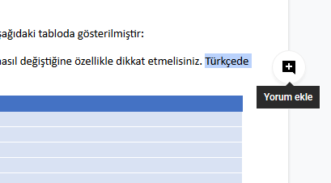

# Eczaneler için İngilizce Dil Kılavuzu

2014 yılının Kasım ayında, eczacıların ve eczane teknisyenlerinin eczane ortamında kullanabilecekleri temel İngilizce kalıpları ve dilbilgisini öğrenebilecekleri bir kılavuz hazırladım ve bir web sitesi üzerinden yayınladım. Zaman içinde internet sitesini kapatmak zorunda kaldım, kılavuz da benim bilgisayarımdaki bir dosya olarak öylece kaldı. Aradan 5 yıl geçtikten sonra, bu kılavuzu açık bir kitap olarak yayınlamaya karar verdim. Bu kılavuzdan istediğiniz gibi faydalanabilir, aynı şekilde paylaşmak şartıyla değiştirebilir ve uyarlayabilirsiniz.

[@erdemdemir](https://twitter.com/erdemdemir)

## Sürümler

### 2019 Eylül

* Çıktı almak için bu [PDF](en/ingilizce_kılavuz_2019-09.pdf) dosyasını indirebilirsiniz.
* Üzerinde çalışmak için Word dosyasını [buradan](en/ingilizce_kılavuz_2019-09.docx) indirebilirsiniz.
* Bu sürüme dair bir düzeltme talebi iletmek için bu [bağlantıyı](https://docs.google.com/document/d/1AGh0qXN5PB8sTEBtN7TqzUTzHo71ss_Rou1xij8kF1w/edit?usp=sharing) kullanabilirsiniz.

## Düzeltme ya da ekleme talebi iletmek için

İlgili sürümün dosyasında düzeltme istediğiniz kısmı seçtikten sonra, "+" tuşuna basarak yorum bırakabilirsiniz.

Veya [@erdemdemir](https://twitter.com/erdemdemir) adresinden bana ulaşabilirsiniz.

## Lisans

 <a xmlns:cc="http://creativecommons.org/ns#" href="https://github.com/erdemdemir/dilkilavuzu" property="cc:attributionName" rel="cc:attributionURL">Erdem Demir</a> isimli yazarın Eczaneler için Dil Kılavuzu başlıklı eseri bu <a rel="license" href="http://creativecommons.org/licenses/by-nc-sa/4.0/"> Creative Commons Atıf-GayriTicari-AynıLisanslaPaylaş 4.0 Uluslararası Lisansı </a> ile lisanslanmıştır. <a xmlns:dct="http://purl.org/dc/terms/" href="https://github.com/erdemdemir/dilkilavuzu" rel="dct:source">https://github.com/erdemdemir/dilkilavuzu</a> bağlantısındaki esere dayalı olarak.